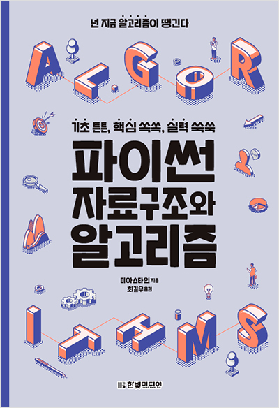
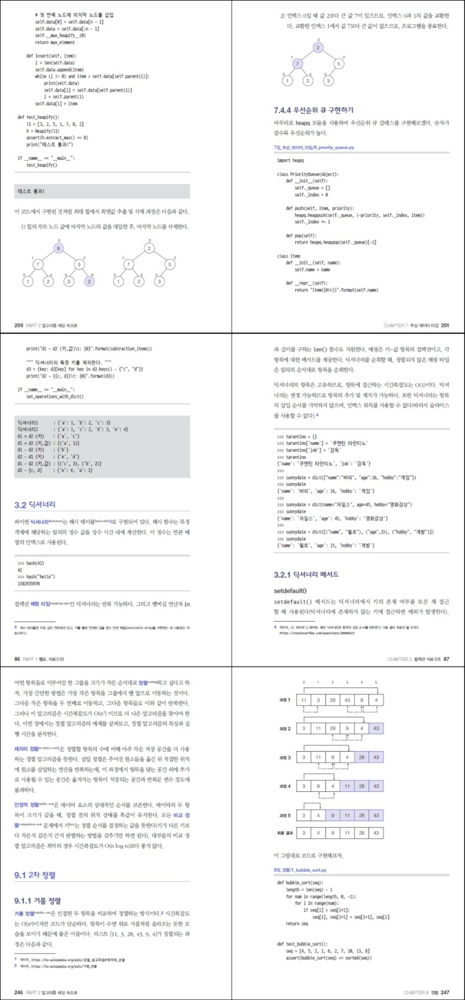

## 👾🐍 MY PUBLISHED BOOK: "master algorithms with python" (2014)

 

 
 

- **➡️ [download the PDF here](book_pdf)**
- **➡️ [published by hanbit media, it was one of the first-ever publications solving classic algorithm](https://www.hanbit.co.kr/store/books/look.php?p_code=B8465804191)**
- **➡️ [this book as a reference for a CMU computer science class](https://www.andrew.cmu.edu/user/ramesh/teaching/course/48784.pdf)**
- **➡️ [last time i checked, it had 4.6/5 stars and 33 reviews](https://www.hanbit.co.kr/store/books/look.php?p_code=B8465804191)**
- **➡️ [this repo used to have 600+ stars and 300 forks](MY_BOOK/600_stars.png)**

 

  

 
 
 

---

### 📖 open-source code 

#### [1st edition (2014)](code/2014)
#### [2nd edition (2023)](code/2023) 
#### [3rd edition (2026)](code/2023)
